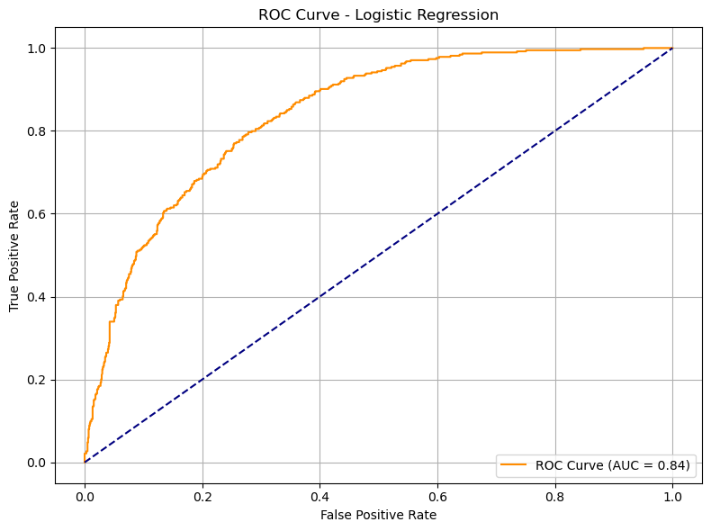
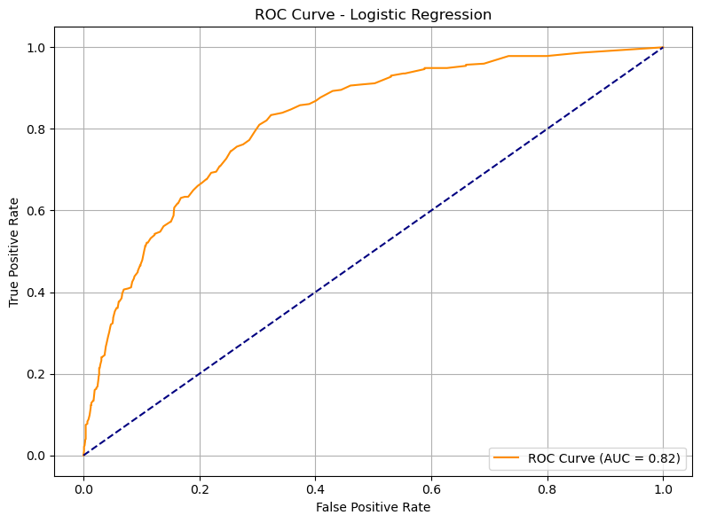

# Telecom-Churn-Prediction


## Customer Churn Prediction from Telecom Behavioral Data 📞📊

This project focuses on predicting **customer churn** based on their telecom service usage and profile attributes. The goal is to explore feature importance, address class imbalance via algorithm-level methods (not resampling), and compare classifier performance.

---

## 📌 Project Objective

To classify customers as **Churned** (`1`) or **Retained** (`0`) based on features like:

- Tenure
- MonthlyCharges & TotalCharges
- Internet services
- Contract type
- Payment method
- Tech support availability

---

## 📁 Dataset Overview

- **Source**: Telecom customer data (7,043 rows)
- **Features**: Binary, categorical, and numerical
- **Target**: `Churn` (binary: 0 = No, 1 = Yes)
- **Preprocessing**:
  - Conversion of `TotalCharges` to numeric
  - Label encoding of categorical features using `LabelEncoder`
  - No oversampling or undersampling used

---

## 🧠 Model Workflow

### 1. **Train-Test Split**
- 80% training / 20% testing
- Stratified to preserve churn distribution

### 2. **Class Imbalance Handling**
- Used `class_weight='balanced'` in models
- No use of SMOTE or undersampling

### 3. **Models Trained**

| Model               | Strategy                                  |
|--------------------|-------------------------------------------|
| Logistic Regression | Balanced class weight, max_iter=1000     |
| Random Forest       | Balanced class weight, default settings  |

---

## 📊 Evaluation Metrics

- Accuracy
- Precision, Recall, F1-Score
- ROC AUC Score
- Confusion Matrix
- ROC Curve Visualization

---

## 📈 ROC Curve




---

## ✅ Key Findings

### 🔹 Logistic Regression
- **AUC Score**: `0.84`
- **Balanced recall and precision**
- Interpretable, generalized performance

### 🔹 Random Forest (before cleaning)
- **AUC Score**: `0.81` (suspiciously high)
- Caused by data leakage from `customerID`
- Dropping `customerID` fixed the feature leakage

---

## 🧠 Summary

- **High-performing features**: `Tenure`, `MonthlyCharges`, `Contract`, `TechSupport`
- `customerID` had to be removed due to leakage
- Final model avoids resampling and uses built-in class balancing
- Logistic Regression provided strong performance without overfitting

---

## 📦 Requirements

```bash
pip install pandas numpy scikit-learn matplotlib seaborn
