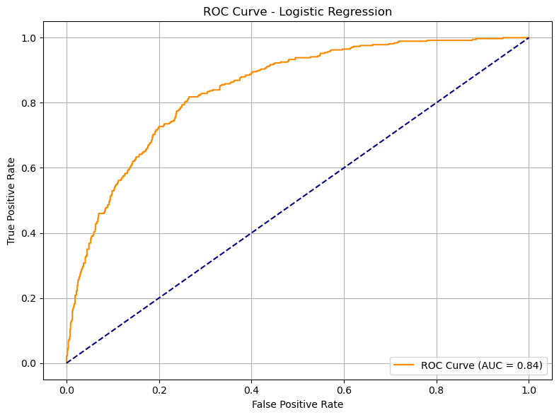

# Telecom-Churn-Prediction


## Customer Churn Prediction from Telecom Behavioral Data 📞📊

This project focuses on predicting **customer churn** based on their telecom service usage and profile attributes. The goal is to explore feature importance, address class imbalance via algorithm-level methods (not resampling), and compare classifier performance.

---
## 🎯 Motivation

Customer retention is critical in the telecom industry where competition is fierce and customer switching costs are low. Churn — the act of customers leaving a service provider — directly impacts revenue and long-term business growth.

Understanding **which customers are likely to churn** enables proactive retention strategies like personalized offers, contract upgrades, and targeted outreach.

By leveraging historical customer data and machine learning, businesses can **predict churn early** and take strategic action to reduce it.

---

## 📌 Project Objective

This project aims to build a **churn prediction system** using historical behavioral and service usage data from telecom customers.

The primary goals are:
- To **identify key features** influencing churn behavior
- To **train interpretable and high-performance classifiers**
- To **handle class imbalance** using model-level techniques (no synthetic sampling)
- To **evaluate models** using meaningful metrics like AUC, F1-score, and recall
- To **visualize feature impact and prediction performance**

---

## 📁 Dataset Overview

- **Source**: Telecom customer data (7,043 rows)
- **Features**: Binary, categorical, and numerical
- **Target**: `Churn` (binary: 0 = No, 1 = Yes)
- **Preprocessing**:
  - Conversion of `TotalCharges` to numeric
  - Label encoding of categorical features using `LabelEncoder`
  - No oversampling or undersampling used

---

## 🧠 Model Workflow

### 1. **Train-Test Split**
- 80% training / 20% testing
- Stratified to preserve churn distribution

### 2. **Class Imbalance Handling**
- Used `class_weight='balanced'` in models
- No use of SMOTE or undersampling

### 3. **Models Trained**

| Model               | Strategy                                  |
|--------------------|-------------------------------------------|
| Logistic Regression | Balanced class weight, max_iter=1000     |
| Random Forest       | Balanced class weight, default settings  |

---
---

## 🔧 Random Forest Hyperparameter Tuning

We tuned the Random Forest classifier using **GridSearchCV** with 5-fold cross-validation. The parameters searched included:

```python
param_grid = {
    'n_estimators': [100, 200],
    'max_depth': [None, 10, 20],
    'min_samples_split': [2, 5, 10],
    'min_samples_leaf': [1, 2, 4],
    'class_weight': ['balanced']
}
```
---
## 📊 Evaluation Metrics

- Accuracy
- Precision, Recall, F1-Score
- ROC AUC Score
- Confusion Matrix
- ROC Curve Visualization

---

## 📈 ROC Curve




---

## ✅ Key Findings

### 🔹 Logistic Regression
- **AUC Score**: `0.84`

### 🔹 Random Forest (before tuning)
- **AUC Score**: `0.82` 

### 🔹 Random Forest (before cleaning)
- **AUC Score**: `0.84` 

---

## 🧠 Summary

- **High-performing features**: `Tenure`, `MonthlyCharges`, `Contract`, `TechSupport`
- `customerID` had to be removed due to least important feature
- Final model avoids resampling and uses built-in class balancing
- Logistic Regression provided strong performance than RF without tuning but it was imporoved when tuned.
---

## 📦 Requirements

```bash
pip install pandas numpy scikit-learn matplotlib seaborn
